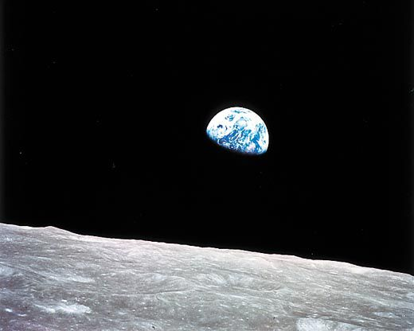

# Explore NASA

- Astrological Picture of the Day
- Martain Sunset 
- Lunar Transit
- Curiosity and Opportunity Images of Mars

#### Link to live site: [Explore NASA](https://explore-nasa.herokuapp.com/)

- Technologies:
    - Javascript
    - AJAX with 4 API calls
    - jQuery
    - CSS
    - HTML

Created an informational web application that allows the user to generate various data sets by toggling and clicking buttons.

- APOD image toggle button generates a new data set daily.

- Martian Sunset toggle button that generates 9 random sunset images. slice() allowed me to grab only sunset images.

- Lunar transit viewing button. forEach() allowed me to show images in order. 

- Rover search: Allows user to view random rover images available per drop down item. Each time the input is submitted a new image will appear set randomly to the image array's data set.

#### Future Enchancements
I would like to time the lunar transit images so that they match the text. There is a delay when image rendering slower than the text.

